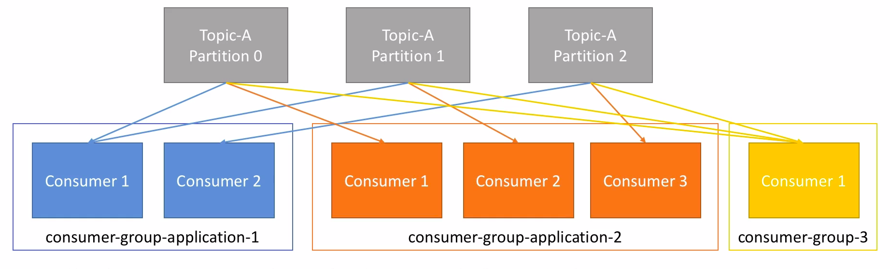
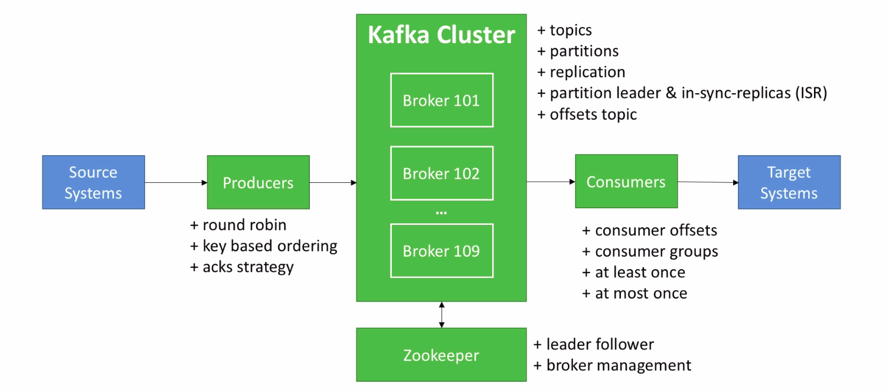

# Apache Kafka for beginners

Course URL: https://www.udemy.com/course/apache-kafka/

Resources: https://courses.datacumulus.com/kafka-beginners-bu5 (Github: https://github.com/simplesteph/kafka-beginners-course)

## Theory

**Topics**: a particular stream of data
- similar to a table in a database
- you can have as many topics as you want
- a topic is identified by its name

Topics are split in **partitions**
- each partition is ordered
- each message within a partition gets an incremental id, called offset (infinite number)
- order of messages is guaranteed only within a partition (not across them)
- data is kept for a limited time (default: 1 week)
- once the data is written, it can't be changed
- data is assigned randomly to a partition unless a key is provided

**Brokers**
- broker can be thought as a "server"
- a Kafka cluster is composed of multiple brokers
- each broker is identified with its ID
- each broker contains certain topic partitions
- after connecting to any broker, you're connected to the entire cluster
- safety is provided via replicating partitions among brokers

**Leader for a partition**
- at any time only one broker can be a leader for a given partition
- only that leader can receive and serve data for a partition
- the other brokers will synchronize the data
- the leader and the ISR (in-sync replica) is determined by Zookeeper

**Producers**
- producers write data to topics
- producers automatically know to which broker and partition to write to
- in case of broker failures, producers will automatically recover

**Consumers**
- consumers read data from topic
- consumers know which broker to read from
- in case of broker failures, consumers know how to recover
- data is read in order within each partition

**Consumer groups**
- consumers read data in consumer groups
- each consumer within a group reads from exclusive partitions
- if you have more consumers than partitions, some consumers will be inactive

**Consumer Offsets**
- Kafka stores the offsets at which a consumer group has been reading
- the offsets committed line in a Kafka topic, named __consumer_offsets
- when a consumer in a group has processed data received from Kafka, it should be committing the offsets
- if a consumer dies, it will be able to reed back from where it left off thanks to the committed consumer offsets.
- consumers choose when to commit offsets
    * at most once:
        * offsets are committed as soon as the message is received
        * if the processing goes wrong, the message will be lost (it won't be read again)
    * At least once
        * offsets are committed after the message is processed
        *  if the processing goes wrong, the message will be read again
        * this can result in duplicate processing of messages
    * Exactly once:
        * can be achieved for Kafka => Kafka workflows using Kafka Streams API
        * for Kafka => External System workflows, use an idempotent consumer (processing repeated messages won't impact your system)
        

